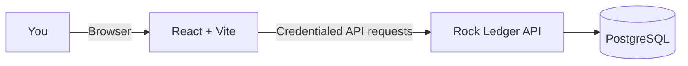

<picture>
  <source media="(prefers-color-scheme: dark)" srcset="docs/brand/dark-mode-horizontal-header.webp">
  
</picture>

# Frontend

> A clear, secure workspace for the ministry's day-to-day finances.

[](https://react.dev/)
[](https://vite.dev/)
[](https://nodejs.org/)

**Rock Ledger** is the React web application for Rock Mission Ministries NPC. Capture and review ledger activity, import Capitec statements, and manage access from one interface.

| [Backend repository](https://github.com/mr-h-digital/rock-ledger-api) | [Live site](https://mr-h-digital.github.io/rock-ledger-web/) |
|:---:|:---:|

## At a glance

| Ledger workspace | Secure access | Statement review |
|---|---|---|
| Capture income, expenses, transfers, and loans; correct entries with reversals. | Password + authenticator code, with role-aware screens for admins, treasurers, and viewers. | Upload Capitec PDFs, inspect parsed lines, then choose what to post. |



## Get started

### You will need

- Node.js and npm
- A running [backend](https://github.com/mr-h-digital/rock-ledger-api) and PostgreSQL database

### 1. Install dependencies

Run from this directory:

```bash
npm install
```

### 2. Set the API address

Create your local environment file:

```powershell
Copy-Item .env.example .env
```

Then set the backend origin in `.env`:

```dotenv
VITE_API_URL=http://localhost:8080
```

Use `cp .env.example .env` on macOS/Linux. Keep the backend's `ALLOWED_ORIGIN` set to the frontend's exact origin (Vite defaults to `http://localhost:5173`).

> **Keep secrets on the server.** Vite bundles `VITE_*` values into browser-visible assets. Never put passwords, tokens, or private keys in frontend environment variables.

### 3. Start the app

```bash
npm run dev
```

Open the URL printed by Vite, usually `http://localhost:5173`.

## Build for production

```bash
npm run build
npm run preview
```

The production site is generated in `dist/`. Relative asset URLs let it work both at the GitHub Pages project path and at a custom-domain root.

### Deploy to GitHub Pages

1. In the repository, open **Settings → Pages** and set **Source** to **GitHub Actions**.
2. Push to `main`. The workflow runs `npm run build` with `VITE_API_URL` pointing at the production API and publishes `dist/`.
3. Do not commit `dist/`; it is generated and ignored.

## Configuration

| Variable | What it controls | Default |
|---|---|---|
| `VITE_API_URL` | Backend API origin (embedded at build time) | `http://localhost:8080` |

## Security by design

- Short-lived access and sign-in-step tokens stay in memory; they are not written to browser storage.
- A backend-managed HttpOnly refresh cookie supports session refresh and is not readable by client-side JavaScript.
- The app sends credentialed requests and the `X-Requested-With` header required by the API.
- The server remains the authority for roles, permissions, and input validation.

## Source map

```text
src/
  Account.jsx      Profile, password change, sign-out
  App.jsx          Session, navigation, ledger capture
  BankImport.jsx   Statement upload and line review
  Login.jsx        Password and authenticator sign-in
  Users.jsx        Administrator user management
  api.js           API client and session handling
  styles.css       Application styles
```

For API routes, roles, accounting rules, and database configuration, continue to the [backend repository](https://github.com/mr-h-digital/rock-ledger-api).